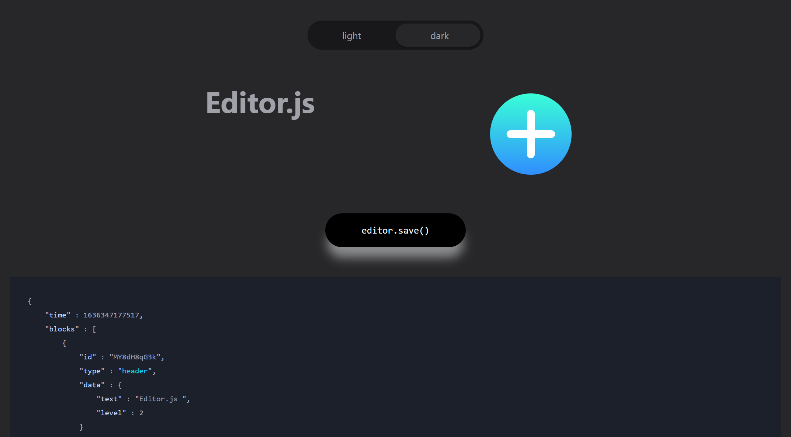

<!-- README.md is generated from README.Rmd. Please edit that file -->

# editorjs


A simple R wrapper of the
[editorjs](https://github.com/codex-team/editor.js) editor.

Editor.js is a Block-Styled editor. Blocks are structural units, of
which the Entry is composed. For example, `Paragraph`, `Heading`,
`Image`, `Video`, `List` are Blocks.

Plan:

  - shiny -\> distill rmarkdown -\> github actions deploy site

## Installation

You can install the development version from
[GitHub](https://github.com/) with:

``` r
# install.packages("devtools")
devtools::install_github("zac-garland/editorjs")
```

## New Editor

``` r
library(editorjs)

editjs()
```

`TODO`

  - [ ] write\_distill\_article
  - [ ] parse\_json
  - [ ] reclass id’s for multiple instances
  - [ ] shiny app to rmd
  - [x] resize event htmlwidgets
  - [ ] add tags `distill` module
  - [x] lightswitch dark / light theme

# preview


